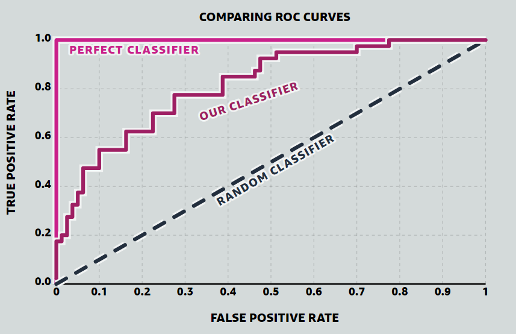

```{r setup, include=FALSE}
options(htmltools.dir.version = FALSE)
```

```{r xaringan-all, echo=FALSE}
library(countdown)
library(xaringan)
library(xaringanExtra)
library(knitr)

hook_source <- knitr::knit_hooks$get('source')
knitr::knit_hooks$set(source = function(x, options) {
  x <- stringr::str_replace(x, "^[[:blank:]]?([^*].+?)[[:blank:]]*#<<[[:blank:]]*$", "*\\1")
  hook_source(x, options)
})

xaringanExtra::use_broadcast()
xaringanExtra::use_freezeframe()
xaringanExtra::use_scribble()
#xaringanExtra::use_slide_tone()
xaringanExtra::use_search(show_icon = TRUE)
xaringanExtra::use_freezeframe()
xaringanExtra::use_clipboard()
xaringanExtra::use_tile_view()
xaringanExtra::use_panelset()
xaringanExtra::use_editable(expires = 1)
xaringanExtra::use_fit_screen()
xaringanExtra::use_extra_styles(
  hover_code_line = TRUE,         
  mute_unhighlighted_code = TRUE  
)

```

class: inverse, center, title-slide, middle

<style>
.title-slide .remark-slide-number {
  display: none;
}
</style>

```{r load_packages, message=FALSE, warning=FALSE, include=FALSE}
library(fontawesome)
```

# Remotely Sensing Cities and Environments

### Lecture 6: Classification The Big Questions (Lecture 5 continued) and Accuracy

### 28/06/2022 (updated: `r format(Sys.time(), "%d/%m/%Y")`)

`r fa("paper-plane", fill = "white")`[a.maclachlan@ucl.ac.uk](mailto:a.maclachlan@ucl.ac.uk)
`r fa("twitter", fill = "white")`[andymaclachlan](https://twitter.com/andymaclachlan)
`r fa("github", fill = "white")`[andrewmaclachlan](https://github.com/andrewmaclachlan)
`r fa("map-marker", fill = "white")`[Centre for Advanced Spatial Analysis, UCL](https://www.ucl.ac.uk/bartlett/casa/)

<a href="https://github.com/andrewmaclachlan" class="github-corner" aria-label="View source on GitHub"><svg width="80" height="80" viewBox="0 0 250 250" style="fill:#fff; color:#151513; position: absolute; top: 0; border: 0; left: 0; transform: scale(-1, 1);" aria-hidden="true"><path d="M0,0 L115,115 L130,115 L142,142 L250,250 L250,0 Z"></path><path d="M128.3,109.0 C113.8,99.7 119.0,89.6 119.0,89.6 C122.0,82.7 120.5,78.6 120.5,78.6 C119.2,72.0 123.4,76.3 123.4,76.3 C127.3,80.9 125.5,87.3 125.5,87.3 C122.9,97.6 130.6,101.9 134.4,103.2" fill="currentColor" style="transform-origin: 130px 106px;" class="octo-arm"></path><path d="M115.0,115.0 C114.9,115.1 118.7,116.5 119.8,115.4 L133.7,101.6 C136.9,99.2 139.9,98.4 142.2,98.6 C133.8,88.0 127.5,74.4 143.8,58.0 C148.5,53.4 154.0,51.2 159.7,51.0 C160.3,49.4 163.2,43.6 171.4,40.1 C171.4,40.1 176.1,42.5 178.8,56.2 C183.1,58.6 187.2,61.8 190.9,65.4 C194.5,69.0 197.7,73.2 200.1,77.6 C213.8,80.2 216.3,84.9 216.3,84.9 C212.7,93.1 206.9,96.0 205.4,96.6 C205.1,102.4 203.0,107.8 198.3,112.5 C181.9,128.9 168.3,122.5 157.7,114.1 C157.9,116.9 156.7,120.9 152.7,124.9 L141.0,136.5 C139.8,137.7 141.6,141.9 141.8,141.8 Z" fill="currentColor" class="octo-body"></path></svg></a><style>.github-corner:hover .octo-arm{animation:octocat-wave 560ms ease-in-out}@keyframes octocat-wave{0%,100%{transform:rotate(0)}20%,60%{transform:rotate(-25deg)}40%,80%{transform:rotate(10deg)}}@media (max-width:500px){.github-corner:hover .octo-arm{animation:none}.github-corner .octo-arm{animation:octocat-wave 560ms ease-in-out}}</style>

---

```{r, echo=FALSE}
xaringanExtra::use_progress_bar(color = "#0051BA", location = "bottom")
```

# How to use the lectures


- Slides are made with [xaringan](https://slides.yihui.org/xaringan/#1)

- `r fa("search")` In the bottom left there is a search tool which will search all content of presentation

- Control + F will also search 

- Press enter to move to the next result 

- `r fa("pencil-alt")` In the top right let's you draw on the slides, although these aren't saved.

- Pressing the letter `o` (for overview) will allow you to see an overview of the whole presentation and go to a slide

- Alternatively just typing the slide number e.g. 10 on the website will take you to that slide

- Pressing alt+F will fit the slide to the screen, this is useful if you have resized the window and have another open - side by side. 

```{r xaringan-logo, echo=FALSE}
xaringanExtra::use_logo(
  image_url = "img/casa_logo.jpg"
)
```
---
# Lecture outline

.pull-left[

### Part 1: Landcover classification (contiuned)


### Part 2: Accuracy 

]

.pull-right[
```{r echo=FALSE, out.width='100%'}
knitr::include_graphics('img/satellite.png')
```
.small[Source:[Original from the British Library. Digitally enhanced by rawpixel.](https://www.rawpixel.com/image/571789/solar-generator-vintage-style)
]]

---
class: inverse, center, middle

# What do we need (current or historic) landcover data for?

---

class: inverse, center, middle

# Can we just used pre-classified data

---

# Pre-classified data

* GlobeLand30 - 30m for 2000, 2010 and 2020: http://www.globallandcover.com/home_en.html?type=data   

* European Space Agency’s (ESA) Climate Change Initiative (CCI) annual global land cover (300 m) (1992-2015): https://climate.esa.int/en/projects/land-cover/data/

* Dynamic World - near real time 10m: https://www.dynamicworld.app/explore/ 
  * A major benefit of an AI-powered approach is the model looks at an incoming Sentinel-2 satellite image and, for every pixel in the image, estimates the degree of tree cover, how built up a particular area is, or snow coverage if there’s been a recent snowstorm, for example

* MODIS: https://modis.gsfc.nasa.gov/data/dataprod/mod12.php

* Google building data: https://sites.research.google/open-buildings/ 

---

# Dynamic World 

.panelset[

.panel[.panel-name[Data]

* Semi-supervised approach
  * Divided World into regions (Western Hemisphere (160°W to 20°W), Eastern Hemisphere-1 (20°W to 100°E), and Eastern Hemisphere-2 (100°E to 160°W))
  * Divided them into 14 Biomes 
  * Stratified samples based on NASA MCD12Q1 land cover for 2017 + others
]
.panel[.panel-name[Training]

* Expert group labeled approximately 4,000 image tiles  
* Non-expert - 20,000
* 409 image tiles were held back 
* minimum mapping unit of 50 × 50 m (5 × 5 pixels) used Labelbox
* label at least 70% of a tile within 20 to 60 minutes

* skill differential between the non-expert and expert groups
* linearly interpolating the distributions per-pixel from their one-hot encoding, weight on 0.2 experts and 0.3 non-experts

]
.panel[.panel-name[Pre-processing]

* Use SR for labelling BUT used TOA (level L1C) for the model as SR only from 2017
* Masked clouds and shadows
* Weights for each pixel (I think these are the probabilities for each pixel based on the user weights)
  * They work out the 
* Augmentations - rotation of image (rotate them) bands (band ratioing) to improve model
]

.panel[.panel-name[Normalisation]

* We first log-transform the raw reflectance values to equalize the long tail of highly reflective surfaces

* remap percentiles of the log-transformed values to points on a sigmoid function

* use these output values which reduce the value ranges
]

.panel[.panel-name[Classification]


* Fully Convolutional Neural Network (FCNN)
* Learns a mapping from estimated probabilities back to the input reflectances (synthesis model gradiet)
  * basically means it is re-learning from the output data "the backward" model
* Pass all normalized bands except B1, B8A, B9 and B10 after bilinear upscaling to ee.Model.predictImage.

* Runs automatically after each new image

* It looks blobby as the training data is 50x50m and also CNN*


]

.panel[.panel-name[CNN]


* Convolution Neural Network (ConvNet/CNN) form of **deep learning**

* Deep learning is a sub section of machine learning focused on neural networks with big datasets

* The potential issue here is with the convolution = a moving window filter (see next tab)

* This is the start of the CNN process

* Similar to texture, using a moving window.

Further reading: [A Comprehensive Guide to Convolutional Neural Networks — the ELI5 way](https://towardsdatascience.com/a-comprehensive-guide-to-convolutional-neural-networks-the-eli5-way-3bd2b1164a53)


]

.panel[.panel-name[CNN 2]


```{r echo=FALSE, out.width='100%'}
knitr::include_graphics('img/conv.gif')
```
.small[Source:[Original from the British Library. Digitally enhanced by rawpixel.](https://www.rawpixel.com/image/571789/solar-generator-vintage-style)]

]

.panel[.panel-name[Accuracy]


* Accuracy is assessed through a **Confusion matrix** - see next slides
  * This is a common approach in classification
  
* However, they note that this might not be appropriate:
  * Different products
  * Live updates 

]

.panel[.panel-name[Example]

```{r echo=FALSE, out.width='40%', fig.align='center'}

```

.small[Visual comparison of Dynamic World (DW) to other global and regional LULC datasets for validation tile locations in (A) Brazil (−11.437°, −61.460°), (B) Norway, (61.724°, 6.484°), and (C) the United States (39.973°, −123.441°). Datasets used for comparison include 300 m European Space Agency (ESA) Climate Change Initiative (CCI); 100 m Copernicus Global Land Service (CGLS) ProbaV Land Cover dataset; 10 m ESA Sentinel-2 Global Land Cover (S2GLC) Europe 2019; 30 m MapBiomas Brazil dataset; and 30 m USGS National Land Cover Dataset (NLCD). Each map chip represents a 5.1 km by 5.1 km area with corresponding true-color (RGB) Sentinel-2 image shown in the first column. All products have been standardized to the same legend used for DW. Note differences in resolution as well as differences in the spatial distribution and coverage of land use land cover classes. Source:[Brown et al. 2022](https://www.nature.com/articles/s41597-022-01307-4#code-availability)]
]

.panel[.panel-name[Notes]

* The training data is online and also used in the ESRI LULC 2020 map: https://doi.pangaea.de/10.1594/PANGAEA.933475?format=html#download

* The code is online - see the paper.

]
]
---
class: inverse, center, middle


# Before we progress....thoughts on this?

--

### What was the data (SR, TOA)

### How was it trained

### What are the issues

### Do you think it's any good

---

class: inverse, center, middle

# Next up 

# Object based image analysis and sub pixel analysis

---

# Object based image analysis (OBIA)

.pull-left[

* Does a raster cell represent an object on the ground?

* Instead of considering cells we consider shapes based on the similarity (homogeneity) or difference (heterogeneity) of the cells = **superpixels**

* **SLIC** (Simple Linear Iterative Clustering) Algorithm for Superpixel generation is the [most common method](doi:10.1109/TPAMI.2012.120)
  * regular points on the image 
  * work out spatial distance (from point to centre of pixel) = **closeness to centre**
  * colour difference (RGB vs RGB to centre point) = **homogenity of colours** 


]

.pull-right[

```{r echo=FALSE, out.width='40%', fig.align='center'}
knitr::include_graphics('img/supercells.gif')
```

.small[Supercells Source:[Nowosad 2021](https://jakubnowosad.com/ogh2021/#10)]
]

]

---

# Object based image analysis (OBIA) 2

.pull-left[

* Each iteration the centre moves- 4-10 is best (based on orignal paper)

* The values can change and the boarders move (like k-means?)

* Doesn't consider connectivity = very small cells

* Can enforce connectivity (remove small areas and merge them)

* $S$ = distance between initial points

* $m$ = compactness = balance between physical distance (larger value) and colour (spectral distance, then smaller $m$) 
]

.pull-right[

* Can only use Euclidean distance in SLIC

```{r echo=FALSE, out.width='100%', fig.align='center'}
knitr::include_graphics('img/SLIC.png')
```

.small[Supercells Source:[Darshite Jain](https://darshita1405.medium.com/superpixels-and-slic-6b2d8a6e4f08)]
]

---

# Object based image analysis (OBIA) 3


.pull-left[

* **Supercells** package can use any distance measure (e.g. dissimilarity)

* $k$ = number of super pixels

* $compactness$ = impact of spatial (higher value) vs colour (lower value)

* $transform$ = not on raw data, but to LAB colour space

* We can then take the [average values per object](https://jakubnowosad.com/ogh2021/#24) and classify them using methods we've seen

* Other metrics can also be computed - e.g. length to width ratio (see Jensen p.418)

]

.pull-right[
```{r echo=FALSE, out.width='100%', fig.align='center'}
knitr::include_graphics('img/supercells2.png')
```

.small[Supercells Source:[Nowosad 2021](https://jakubnowosad.com/ogh2021/#10)]
]

---
# Object based image analysis (OBIA) 3


Note that there are many OBIA classifiers, they all do similar, but slightly different processes - see Jensen page 415

A more advanced package would be [**SegOptim**](https://segoptim.bitbucket.io/docs/) that can use algorithms from other software

```{r echo=FALSE, out.width='55%', fig.align='center'}
knitr::include_graphics('img/segOptim.jpg')
```

.small[SegOptim Source:[João Gonçalves 2020](https://segoptim.bitbucket.io/docs/)]

---

# Sub pixel analysis 

If you have a pixel composed of a range of land cover types should it **be classified as one landcover** or should **we calculate the proportions ?**

```{r echo=FALSE, out.width='40%', fig.align='center'}
knitr::include_graphics('img/high_res_medium_res.PNG')
```

.small[Comparison of true colour high spatial resolution data (a) (acquired from 14 March 2007) and Landsat surface reflectance (b) (acquired on 6 October 2007 [path 112]), highlighting the spatial detail captured by high-resolution imagery (c) and the same areas as observed by Landsat (d) for the subset East Beechboro used within this study Source:[MacLachlan et al. 2017](https://www.tandfonline.com/doi/pdf/10.1080/01431161.2017.1346403?needAccess=true&)]

---

# Sub pixel analysis 

Termed (all the same): Sub pixel classification, Spectral Mixture Analysis (SMA), Linear spectral unmixing 

.pull-left[

* SMA determines the **proportion** or **abundance** of landcover per pixel

* the assumption that reflectance measured at each pixel is represented by the linear sum of endmembers weighted by the associated endmember fraction

* Typically we have a few endmembers that are **spectrally pure**
]

.pull-right[

```{r echo=FALSE, out.width='100%', fig.align='center'}

```

.small[Source:[Machado and Small (2013) 2017](https://www.researchgate.net/figure/Perfect-decomposition-with-a-Linear-Spectral-Mixture-Model-LSMM-on-a-30-m-pixel-formed_fig6_259715697)]

]

https://jakob.schwalb-willmann.de/blog/spectral-unmixing-using-rstoolbox/

http://bleutner.github.io/RStoolbox/rstbx-docu/RStoolbox.html

---
# Sub pixel analysis 2

.pull-left[

* Sum of end member reflectance * fraction contribution to best-fit mixed spectrum


$$p_\lambda=\sum_{i=1}^{n} (p_{i\lambda} * f_i) + e_\lambda$$
$p_\lambda$ =  The pixel reflectance

$p_i\lambda$ = reflectance of endmember $i$

$f_i$ = fractional cover of end member $i$

$n$ = number of endmembers

$e_\lambda$ = model error

See, Jensen page 480 - following example taken from there
]

.pull-right[

```{r echo=FALSE, out.width='100%', fig.align='center'}
  knitr::include_graphics('img/mixture.PNG')
```

.small[Source:[Plaza et al. (2002)](https://ieeexplore.ieee.org/stamp/stamp.jsp?tp=&arnumber=1046852)]

]


---

# Sub pixel analysis 3

Not as complicated as it looks...here are some end members for bands 3 and 4

```{r echo=FALSE, out.width='100%', fig.align='center'}
library(ggplot2)
library(tidyverse)
Band <- c(3,4)
Water <- c(13,5) 
Vegetation <- c(22, 80)
Soil <- c(70,60)

all<-tibble(Band, Water, Vegetation, Soil)

knitr::kable(head(all), format = 'html')
```

We take the [inverse matrix](https://www.mathsisfun.com/algebra/matrix-inverse.html) of them ...

$$\begin{bmatrix}13 & 22 & 70\\
5 & 80 & 60\\
1 & 1 & 1
\end{bmatrix} \begin{bmatrix}-0.0053 & -0.0127 & 1.1322\\
-0.0145 & 0.0150 & 0.1137\\
0.0198 & -0.0024 & -0.2460
\end{bmatrix}$$

---
# Sub pixel analysis 4


Then solve ... if our values for the pixel are **25** (band 3) and **57** (band 4)the rows of the first matrix are multiplied by the columns of the second one

$$\begin{bmatrix}f_{water}\\
f_{veg}\\
f_{soil}
\end{bmatrix}\begin{bmatrix}-0.0053 & -0.0127 & 1.1322\\
-0.0145 & 0.0150 & 0.1137\\
0.0198 & -0.0024 & -0.2460
\end{bmatrix} \begin{bmatrix}25\\
57\\
1
\end{bmatrix}$$
This looks like...(from [matrix  calculator](https://matrixcalc.org/en/))

$$\left(\begin{matrix}
\frac{-53}{10000}*25+\frac{-127}{10000}*57+\frac{5661}{5000}*1 \\
\frac{-29}{2000}*25+\frac{3}{200}*57+\frac{1137}{10000}*1 \\
\frac{99}{5000}*25+\frac{-3}{1250}*57+\frac{-123}{500}*1
\end{matrix}\right)$$
---
# Sub pixel analysis 5

And gives...
$$\begin{bmatrix}0.27\\
0.61\\
0.11
\end{bmatrix}\begin{bmatrix}-0.0053 & -0.0127 & 1.1322\\
-0.0145 & 0.0150 & 0.1137\\
0.0198 & -0.0024 & -0.2460
\end{bmatrix} \begin{bmatrix}25\\
57\\
1
\end{bmatrix}$$
This means that within this pixel we have:

* 27% water
* 61% vegetation
* 11% soil

---
# Sub pixel analysis 6

Issues / considerations:

.pull-left[

* Pixel purity ?

* Number of End members
  * simplify the process and use the **V-I-S model** in urban areas: Vegetation-Impervious surface-Soil (V-I-S) fractions

* Multiple endmember spectral analysis (MESMA)
  * Increase computation
  * or use a spectral library 
]

.pull-right[

```{r echo=FALSE, out.width='100%', fig.align='center'}
  knitr::include_graphics('img/VIS.PNG')
```

.small[Source:[Phinn et al. (2002) Monitoring the composition of urban environments based on the vegetation-impervious surface-soil (VIS) model by subpixel analysis techniques,](https://ieeexplore.ieee.org/stamp/stamp.jsp?tp=&arnumber=1046852)]

]

---
# Accuracy assessment

After producing and output we need to assign an accuracy value to it (common to machine learning).

.pull-left[

In remote sensing we focus on:

* PA Producer accuracy (recall or true positive rate or sensitivity)
* UA User’s accuracy (consumer’s accuracy or precision or
positive predictive value
* OA the (overall) accuracy
]

.pull-right[
```{r echo=FALSE, out.width='100%', fig.align='center'}
knitr::include_graphics('img/matrix.PNG')
```

.small[Source:[Barsi et al. 2018 Accuracy Dimensions in Remote Sensing](https://www.int-arch-photogramm-remote-sens-spatial-inf-sci.net/XLII-3/61/2018/isprs-archives-XLII-3-61-2018.pdf)]
]

---
# Accuracy assessment 2

.pull-left[

```{r echo=FALSE, out.width='100%', fig.align='center'}
knitr::include_graphics('img/true_positive.png')
```

.small[Source:[PICO](https://www.pico.net/kb/what-is-a-false-positive-rate/)]
]


.pull-right[
```{r echo=FALSE, out.width='100%', fig.align='center'}
knitr::include_graphics('img/matrix.PNG')
```

.small[Source:[Barsi et al. 2018 Accuracy Dimensions in Remote Sensing](https://www.int-arch-photogramm-remote-sens-spatial-inf-sci.net/XLII-3/61/2018/isprs-archives-XLII-3-61-2018.pdf)]
]

---


# Accuracy assessment 3

.pull-left[

* **producer’s accuracy** defined as the fraction of correctly classified 
pixels (TP) compared to ground truth data (TP+FN) $\frac{TP}{TP+FN}$

* **user’s accuracy** defined as the fraction of correctly classified pixels (TP) relative to all others classified as a particular land cover(TP+FP) $\frac{TP}{TP+FP}$

* **overall accuracy** that represents the combined  fraction of correctly classified pixels (TP +TN) across all land cover types (TP+FP+FN+TN) $\frac{TP +TN}{TP+FP+FN+TN}$

]

.pull-right[

```{r echo=FALSE, out.width='100%', fig.align='center'}
knitr::include_graphics('img/matrix.PNG')
```

.small[Source:[Barsi et al. 2018 Accuracy Dimensions in Remote Sensing](https://www.int-arch-photogramm-remote-sens-spatial-inf-sci.net/XLII-3/61/2018/isprs-archives-XLII-3-61-2018.pdf)]
]

---

# Accuracy assessment 4

Example

```{r echo=FALSE, out.width='100%', fig.align='center'}
knitr::include_graphics('img/example_matrix.PNG')
```

.small[Source:[Brown et al. 2022 Dynamic World, Near real-time global 10m land use land cover mapping](https://www.nature.com/articles/s41597-022-01307-4.pdf)]
]
---

# Accuracy assessment 5

.pull-left[

* Errors of omission (100-producer's accuracy)
  * Have been omitted from correct class
  * Type 1 error
  * Urban = 1/23, 4%
  * Urban producer = 22/23, 95.65%
   
* Errors of commission (100- user's accuracy)
  * Reference sites left out from classification
  * Urban = 9/31, 29%
  * Urban user = 7/31, 22.58%

* Kappa coefficient


]

.pull-right[

```{r echo=FALSE, out.width='100%', fig.align='center'}

```

.small[Source:[Earth Systems Science and Remote Sensing](https://medium.com/@wenzhao.li1989/accuracy-assessment-d164e492274b)]
]
---
# Accuracy assessment 6


Producer accuracy ... 

.pull-left[

> i am pleased that 95.65 % of the urban area that was identified in the reference is urban in the classification 

User accuracy ... 

> as a user i only find that only 22.58% of the time when i visit an urban area is it acutally urban

Overall accuracy is 77.89%

* is this acceptable for the user? 

* there is no single right choice for accuracy measurements

]

.pull-right[

```{r echo=FALSE, out.width='100%', fig.align='center'}

```

.small[Source:[Earth Systems Science and Remote Sensing](https://medium.com/@wenzhao.li1989/accuracy-assessment-d164e492274b)]

* This can also be changed to a fuzzy matrix (e.g. Decidous forest classified as evergreen forest - see Jensen p.575)

]
---
# Accuracy assessment 8

### To Kappa or not to Kappa?

* Designed to express the accuracy of an image compared to the results by chance

* Ranges from 0 to 1

> "Sadly the calls to abandon the use of the kappa coefficient in accuracy assessment seem to have fallen on deaf ears. It may be that the kappa coefficient is still widely used because it has become ingrained in practice and there may be a sense of obligation to use it"

.center[

$k=\frac{p_o - p_e}{1- p_e}$
]

$p_o$ is the proportion of cases correctly classified (accuracy)

$p_e$ expected cases correctly classified by chance (further equations in [Foody 2020](https://reader.elsevier.com/reader/sd/pii/S0034425719306509?token=47B253784FA5346F4A2E26B6DA796DBE71DC53A34AE76AAB1FFA43927EC021937C0C108A42154C4AE774083E4C7BD52F&originRegion=eu-west-1&originCreation=20220707132403))

.small[Source:[Explaining the unsuitability of the kappa coefficient in the assessment and comparison of the accuracy of thematic maps obtained by image classification. Foody 2020](https://reader.elsevier.com/reader/sd/pii/S0034425719306509?token=47B253784FA5346F4A2E26B6DA796DBE71DC53A34AE76AAB1FFA43927EC021937C0C108A42154C4AE774083E4C7BD52F&originRegion=eu-west-1&originCreation=20220707132403)]
---
# Kappa issues 


.pull-left[

* What is a good value?

```{r echo=FALSE, out.width='100%', fig.align='center'}
knitr::include_graphics('img/Kappa_issue1.png')
```


]

.pull-right[

* How Kappa values can we have for different levels of accuracy (on x axis )


```{r echo=FALSE, out.width='100%', fig.align='center'}

```

]

.small[Source:[Explaining the unsuitability of the kappa coefficient in the assessment and comparison of the accuracy of thematic maps obtained by image classification. Foody 2020](https://reader.elsevier.com/reader/sd/pii/S0034425719306509?token=47B253784FA5346F4A2E26B6DA796DBE71DC53A34AE76AAB1FFA43927EC021937C0C108A42154C4AE774083E4C7BD52F&originRegion=eu-west-1&originCreation=20220707132403)]
---
class: inverse, center, middle

# Have i used Kappa? 

--

### See Jensen page 570

---


class: inverse, center, middle

# In remote sensing this is typically where we'd stop...but not necessarily in machine learning 

---

class: inverse, center, middle

# A brief overview...

---

# Beyond remote sensing 


Beyond **traditional** remote sensing accuracy assessment...

.pull-left[

Problem with recall (Producer accuracy) vs Precision (User accuracy)

False positives (Producer) or false negatives (User) more important?


* model with high recall = true positives but some false positives (predicted urban but land cover that isn't urban)

* Model with high precision = (actual urban but predicted other landcover)

* See [MLU-explain](https://mlu-explain.github.io/precision-recall/) for an interactive example
]

.pull-right[

```{r echo=FALSE, out.width='80%', fig.align='center'}
knitr::include_graphics('img/true_positive.png')
```

.small[Source:[PICO](https://www.pico.net/kb/what-is-a-false-positive-rate/)]


```{r echo=FALSE, out.width='80%', fig.align='center'}
knitr::include_graphics('img/matrix.PNG')
```

.small[Source:[Barsi et al. 2018 Accuracy Dimensions in Remote Sensing](https://www.int-arch-photogramm-remote-sens-spatial-inf-sci.net/XLII-3/61/2018/isprs-archives-XLII-3-61-2018.pdf)]
]

---

# F1 `r emo::ji("car")`

.pull-left[

The F1-Score (or F Measure) combines both recall (Producer accuracy) and Precision (User accuracy):


* $F1 = \frac{TP}{TP + \frac{1}{2}*(FP+FN)}$


* Value from 0 to 1, where 1 is better performance

.small[Source:[MLU-EXPLAIN](https://mlu-explain.github.io/precision-recall/)]
]


.pull-right[
```{r echo=FALSE, out.width='80%', fig.align='center'}
knitr::include_graphics('img/matrix.PNG')
```

.small[Source:[Barsi et al. 2018 Accuracy Dimensions in Remote Sensing](https://www.int-arch-photogramm-remote-sens-spatial-inf-sci.net/XLII-3/61/2018/isprs-archives-XLII-3-61-2018.pdf)]
]

---
# Receiver Operating Characteristic Curve

Receiver Operating Characteristic Curve (the ROC Curve)

.pull-left[

* Receiver Operating Characteristic Curve (the ROC Curve)

* Originates from WW2, USA wanted to minimize noise from radar to identity (true positives) and not miss aircraft

* **Changing the threshold value of classifier** will change the True Positive rate

* Closer to 1 is what we want, below the random means the classifier is not any better than random. 

]

.pull-right[

```{r echo=FALSE, out.width='100%', fig.align='center'}

```

.small[Source:[MLU-EXPLAIN](https://mlu-explain.github.io/roc-auc/)]

]

---
# Area Under the ROC Curve

Area Under the ROC Curve (AUC, or AUROC)

.pull-left[

* Simply the area under the curve 

* Compare models easily (no need to look at the ROC curve)

* Perfect value will be 1, random will be 0.5

> "The AUC is the probability that the model will rank a randomly chosen positive example more highly than a randomly chosen negative example."...

e.g. model always give positive from true negative = AUC 0
]

.pull-right[

```{r echo=FALSE, out.width='100%', fig.align='center'}

```

.small[Source:[MLU-EXPLAIN](https://mlu-explain.github.io/roc-auc/)]

]

---
class: inverse, center, middle

# How to we get test data for the accuracy assessment?

---

# Remote sensing approach (sometimes) 


.pull-left[

Same process for all:

  * class definition
  * pre-processing
  * training
  * pixel assignment
  * accuracy assessment

Guidelines

* Collect training data - suggested as around 250 pixels per class (Foody and Mather, 2006)

* Simply go and collect (or use Google Earth) ground truth data - 50 per class (Congalton, 2001).

* Produce an error matrix

] 
 
  
.pull-right[
```{r echo=FALSE, out.width='100%', fig.align='center'}
knitr::include_graphics('img/supervised-diagram.png')
```
.small[Source:[GIS Geography](https://gisgeography.com/supervised-unsupervised-classification-arcgis/)
]
]


---

class: inverse, center, middle

# Problems? 

--

### Chapter 13 in Jensen (p.557) cover accuracy assessment...but not the following


---

# Good approach - train and test split 


* This is simply holding back a % of the original data used to train the model to then test it at the end

* See the [validation section (10.6.7)](https://andrewmaclachlan.github.io/CASA0005repo_20192020/advanced-r-maup-and-more-regression.html) for an example in linear regression


```{r echo=FALSE, out.width='100%', fig.align='center'}

```
.small[Source:[Michael Galarnyk](https://towardsdatascience.com/understanding-train-test-split-scikit-learn-python-ea676d5e3d1)
]


---

class: inverse, center, middle


# BUT..."Spatial autocorrelation between training and test sets"

--

## Remember spatial autocorrelation?

--

## A measure of similarity between nearby data...

---

# Spatial dependence....


Karasiak et al. 2022, [Spatial dependence between training and test sets: another pitfall of classification accuracy assessment in remote sensing](https://link.springer.com/article/10.1007/s10994-021-05972-1)

```{r echo=FALSE, out.width='55%', fig.align='center'}

```
.small[Average overall accuracy based on the RF classifier for each cross-validation strategy (k-fold CV, LOO CV, SLOO CV) at pixel and object levels. Models were fitted with reference samples of Herault-34 and repeated 10 times (i.e. the y-axis provides the average OA value ± standard deviation). The premature stopping of the pixel-based LOO and SLOO CV approaches was due to excessive computational time Source:[Karasiak et al. 2022](https://towardsdatascience.com/understanding-train-test-split-scikit-learn-python-ea676d5e3d1)
]

(1) a k-fold cross-validation (k-fold-CV) based on random splitting
(2) a non-spatial leave-one-out cross-validation (LOO CV) 
(3) a spatial leave-one-out cross-validation (SLOO CV) using a distance-based buffer relying on Moran’s I statistics.

---

class: inverse, center, middle


# Why do the objects perform better than the pixels?

---


# Best approach - cross validation

.pull-left[

Really classification of imagery is a machine learning task...

..So why can't we apply the same methods?

Perhaps as it is meant to be iterative...

...e.g. the classifier underpredicts urban then you can go and adjust the training data...

]

.pull-right[
```{r echo=FALSE, out.width='100%', fig.align='center'}
knitr::include_graphics('img/cross.jpg')
```
.small[Source:[Wikipedia](https://en.wikipedia.org/wiki/Cross-validation_%28statistics%29)
]
]
---
# Best approach - cross validation 2

Waldo Tobler's first Law of Geography...

> "everything is related to everything else, but near things are more related than distant things."

* Are training and testing points too close in geographic space?

* How can we deal with taking a sample of training data for testing when they are possibly from the same polygon of training data...

> ‘Training’ observations near the ‘test’ observations can provide a kind of ‘sneak preview’: information that should be unavailable to the training dataset. 

https://geocompr.robinlovelace.net/spatial-cv.html


https://machinelearningmastery.com/loocv-for-evaluating-machine-learning-algorithms/#:~:text=fold%20Cross%2DValidation-,Leave%2Done%2Dout%20cross%2Dvalidation%2C%20or%20LOOCV%2C,has%20the%20maximum%20computational%20cost.

https://machinelearningmastery.com/k-fold-cross-validation/
---

class: inverse, center, middle


# Spatial cross validation 


---

#  Spatial cross validation 2

.pull-left[

* spatially partition the folded data

* disjoint using k -means clustering 

* same as cross validaton but with clustering to the folds...

]

.pull-right[
```{r echo=FALSE, out.width='100%', fig.align='center'}
knitr::include_graphics('img/13_partitioning.png')
```
.small[Spatial visualization of selected test and training observations for cross-validation of one repetition. Random (upper row) and spatial partitioning (lower row). Source:[Lovelace et al. 2022](https://geocompr.robinlovelace.net/spatial-cv.html)
]
]

---

#  Spatial cross validation 3

Lovelace et al. (2022) use a Support Vector Machine classifier that requires hyperparameters (set before the classification)

Standard SVM then the classifier will try to **overfit** = perfect for the current data but useless for anything else...

Cortes and Vapnik - **soft margin**, permit classifications = controlled with **C**

.pull-left[

```{r echo=FALSE, out.width='60%', fig.align='center'}

```
.small[Source:[Soner Yildirim](https://towardsdatascience.com/hyperparameter-tuning-for-support-vector-machines-c-and-gamma-parameters-6a5097416167)
]
]

.pull-right[

```{r echo=FALSE, out.width='60%', fig.align='center'}

```
.small[Source:[Soner Yildirim](https://towardsdatascience.com/hyperparameter-tuning-for-support-vector-machines-c-and-gamma-parameters-6a5097416167)
]

]
* **C** = adds penalty (proportional to distance from decision line) for each classified point. Small = image on right, large = image on left

.small[Source:[Soner Yildirim](https://towardsdatascience.com/hyperparameter-tuning-for-support-vector-machines-c-and-gamma-parameters-6a5097416167)
]

---

#  Spatial cross validation 4

Lovelace et al. (2022) use a Support Vector Machine classifier that requires hyperparameters (set before the classification)


* **Gamma (or also called Sigma)** = controls the influence of a training point within the classified data
  * low = big radius and many points in same group
  * high = low radius and many groups
  
  
.pull-left[

```{r echo=FALSE, out.width='60%', fig.align='center'}

```
.small[Source:[Soner Yildirim](https://towardsdatascience.com/hyperparameter-tuning-for-support-vector-machines-c-and-gamma-parameters-6a5097416167)
]
]

.pull-right[

```{r echo=FALSE, out.width='60%', fig.align='center'}

```
.small[Source:[Soner Yildirim](https://towardsdatascience.com/hyperparameter-tuning-for-support-vector-machines-c-and-gamma-parameters-6a5097416167)
]
]

.small[Source:[Soner Yildirim](https://towardsdatascience.com/hyperparameter-tuning-for-support-vector-machines-c-and-gamma-parameters-6a5097416167)
]
---

#  Spatial cross validation 5

* **Performance level** each spatial fold (taken from our first k-means cross validation fold division). = Top row below

* **Tuning level** each fold (outer) is then divided into 5 again (inner fold).= Bottom row below

*  **Performance estimation** we fit 50 models with random **C** and **Gamma** use the best values to outer fold = **AUROC**


```{r echo=FALSE, out.width='75%', fig.align='center'}
knitr::include_graphics('img/13_cv.png')
```
.small[Schematic of hyperparameter tuning and performance estimation levels in CV. (Figure was taken from Schratz et al. (2019).. Source:[Lovelace et al. 2022](https://geocompr.robinlovelace.net/spatial-cv.html)
]

---

#  Spatial cross validation 6


.pull-left[

**Here we have..**.

* 1 outer fold has 5 inner folds with 50 models = 250 models for **C** and **Gamma**

It's 5 (outer fold)

* Each repetition =  1,250 (250 * 5) 

It's 100 times repeated (5 fold cross validation)

* 125,000 models for best hyperparameters

]

.pull-right[

**So .... what**

```{r echo=FALSE, out.width='100%', fig.align='center'}

```
.small[Boxplot showing the difference in GLM AUROC values on spatial and conventional 100-repeated 5-fold cross-validation. Source:[Lovelace et al. 2022](https://geocompr.robinlovelace.net/spatial-cv.html)
]

]

---

class: inverse, center, middle

# Question: What happens if a classificaiton model doesn't consider spatial autocorrelation ?

---


class: inverse, center, middle

# Question: What methods can we use to deal with it?


---

# Summary 


---

# Task 

For the individual assignment of the module you are required to produce a online portfolio of independent study and response questions.

For the task this week you need to:

* Select **two academic or policy papers / policy targets** that have performed some form of classification on earth observation data. In a maximum of three paragraphs:
  * Briefly state what classification method was used
  * Outline how accuracy was assessed
  * Critically reflect on if it was the best approach to assess the accuracy within that paper and (if necessary) explain and justify possible improvements
  * **Note**, it is fine to consider papers/policies may have included a classified product as part of another model such as we saw in lecture 4.
  
  
---

# Reading

[Land Use Cover Datasets and Validation Tools](https://link.springer.com/content/pdf/10.1007/978-3-030-90998-7.pdf)

https://doodles.mountainmath.ca/blog/2019/10/07/spatial-autocorrelation-co/

https://geocompr.robinlovelace.net/spatial-cv.html

https://link.springer.com/article/10.1007/s10994-021-05972-1

---