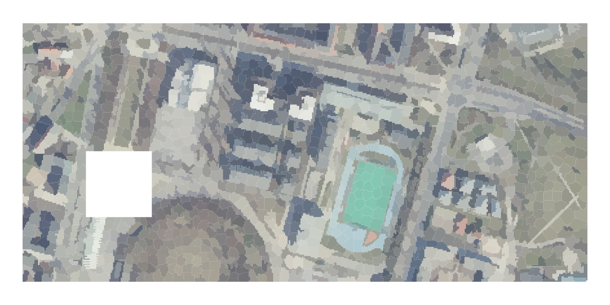

```{r setup, include=FALSE}
options(htmltools.dir.version = FALSE)
```

```{r xaringan-all, echo=FALSE}
library(countdown)
library(xaringan)
library(xaringanExtra)
library(knitr)

hook_source <- knitr::knit_hooks$get('source')
knitr::knit_hooks$set(source = function(x, options) {
  x <- stringr::str_replace(x, "^[[:blank:]]?([^*].+?)[[:blank:]]*#<<[[:blank:]]*$", "*\\1")
  hook_source(x, options)
})

xaringanExtra::use_broadcast()
xaringanExtra::use_freezeframe()
xaringanExtra::use_scribble()
#xaringanExtra::use_slide_tone()
xaringanExtra::use_search(show_icon = TRUE)
xaringanExtra::use_freezeframe()
xaringanExtra::use_clipboard()
xaringanExtra::use_tile_view()
xaringanExtra::use_panelset()
xaringanExtra::use_editable(expires = 1)
xaringanExtra::use_fit_screen()
xaringanExtra::use_extra_styles(
  hover_code_line = TRUE,         
  mute_unhighlighted_code = TRUE  
)

```

class: inverse, center, title-slide, middle

<style>
.title-slide .remark-slide-number {
  display: none;
}
</style>

```{r load_packages, message=FALSE, warning=FALSE, include=FALSE}
library(fontawesome)
```

# Remotely Sensing Cities and Environments

### Lecture 6: Classification The Big Questions (Lecture 5 continued) and Accuracy

### 28/06/2022 (updated: `r format(Sys.time(), "%d/%m/%Y")`)

`r fa("paper-plane", fill = "white")`[a.maclachlan@ucl.ac.uk](mailto:a.maclachlan@ucl.ac.uk)
`r fa("twitter", fill = "white")`[andymaclachlan](https://twitter.com/andymaclachlan)
`r fa("github", fill = "white")`[andrewmaclachlan](https://github.com/andrewmaclachlan)
`r fa("map-marker", fill = "white")`[Centre for Advanced Spatial Analysis, UCL](https://www.ucl.ac.uk/bartlett/casa/)

<a href="https://github.com/andrewmaclachlan" class="github-corner" aria-label="View source on GitHub"><svg width="80" height="80" viewBox="0 0 250 250" style="fill:#fff; color:#151513; position: absolute; top: 0; border: 0; left: 0; transform: scale(-1, 1);" aria-hidden="true"><path d="M0,0 L115,115 L130,115 L142,142 L250,250 L250,0 Z"></path><path d="M128.3,109.0 C113.8,99.7 119.0,89.6 119.0,89.6 C122.0,82.7 120.5,78.6 120.5,78.6 C119.2,72.0 123.4,76.3 123.4,76.3 C127.3,80.9 125.5,87.3 125.5,87.3 C122.9,97.6 130.6,101.9 134.4,103.2" fill="currentColor" style="transform-origin: 130px 106px;" class="octo-arm"></path><path d="M115.0,115.0 C114.9,115.1 118.7,116.5 119.8,115.4 L133.7,101.6 C136.9,99.2 139.9,98.4 142.2,98.6 C133.8,88.0 127.5,74.4 143.8,58.0 C148.5,53.4 154.0,51.2 159.7,51.0 C160.3,49.4 163.2,43.6 171.4,40.1 C171.4,40.1 176.1,42.5 178.8,56.2 C183.1,58.6 187.2,61.8 190.9,65.4 C194.5,69.0 197.7,73.2 200.1,77.6 C213.8,80.2 216.3,84.9 216.3,84.9 C212.7,93.1 206.9,96.0 205.4,96.6 C205.1,102.4 203.0,107.8 198.3,112.5 C181.9,128.9 168.3,122.5 157.7,114.1 C157.9,116.9 156.7,120.9 152.7,124.9 L141.0,136.5 C139.8,137.7 141.6,141.9 141.8,141.8 Z" fill="currentColor" class="octo-body"></path></svg></a><style>.github-corner:hover .octo-arm{animation:octocat-wave 560ms ease-in-out}@keyframes octocat-wave{0%,100%{transform:rotate(0)}20%,60%{transform:rotate(-25deg)}40%,80%{transform:rotate(10deg)}}@media (max-width:500px){.github-corner:hover .octo-arm{animation:none}.github-corner .octo-arm{animation:octocat-wave 560ms ease-in-out}}</style>

---

```{r, echo=FALSE}
xaringanExtra::use_progress_bar(color = "#0051BA", location = "bottom")
```

# How to use the lectures


- Slides are made with [xaringan](https://slides.yihui.org/xaringan/#1)

- `r fa("search")` In the bottom left there is a search tool which will search all content of presentation

- Control + F will also search 

- Press enter to move to the next result 

- `r fa("pencil-alt")` In the top right let's you draw on the slides, although these aren't saved.

- Pressing the letter `o` (for overview) will allow you to see an overview of the whole presentation and go to a slide

- Alternatively just typing the slide number e.g. 10 on the website will take you to that slide

- Pressing alt+F will fit the slide to the screen, this is useful if you have resized the window and have another open - side by side. 

```{r xaringan-logo, echo=FALSE}
xaringanExtra::use_logo(
  image_url = "img/casa_logo.jpg"
)
```
---
# Lecture outline

.pull-left[

### Part 1: Landcover classification (contiuned)


### Part 2: Accuracy 

]

.pull-right[
```{r echo=FALSE, out.width='100%'}
knitr::include_graphics('img/satellite.png')
```
.small[Source:[Original from the British Library. Digitally enhanced by rawpixel.](https://www.rawpixel.com/image/571789/solar-generator-vintage-style)
]]

---
class: inverse, center, middle

# What do we need (current or historic) landcover data for?

---

class: inverse, center, middle

# Can we just used pre-classified data

---

# Pre-classified data

* GlobeLand30 - 30m for 2000, 2010 and 2020: http://www.globallandcover.com/home_en.html?type=data   

* European Space Agency’s (ESA) Climate Change Initiative (CCI) annual global land cover (300 m) (1992-2015): https://climate.esa.int/en/projects/land-cover/data/

* Dynamic World - near real time 10m: https://www.dynamicworld.app/explore/ 
  * A major benefit of an AI-powered approach is the model looks at an incoming Sentinel-2 satellite image and, for every pixel in the image, estimates the degree of tree cover, how built up a particular area is, or snow coverage if there’s been a recent snowstorm, for example

* MODIS

* Google building data: https://sites.research.google/open-buildings/ 

---

# Dynamic World 

.panelset[

.panel[.panel-name[Data]

* Semi-supervised approach
  * Divided World into regions (Western Hemisphere (160°W to 20°W), Eastern Hemisphere-1 (20°W to 100°E), and Eastern Hemisphere-2 (100°E to 160°W))
  * Divided them into 14 Biomes 
  * Stratified samples based on NASA MCD12Q1 land cover for 2017 + others
]
.panel[.panel-name[Training]

* Expert group labeled approximately 4,000 image tiles  
* Non-expert - 20,000
* 409 image tiles were held back 
* minimum mapping unit of 50 × 50 m (5 × 5 pixels) used Labelbox
* label at least 70% of a tile within 20 to 60 minutes

* skill differential between the non-expert and expert groups
* linearly interpolating the distributions per-pixel from their one-hot encoding, weight on 0.2 experts and 0.3 non-experts

]
.panel[.panel-name[Pre-processing]

* Use SR for labelling BUT used TOA (level L1C) for the model as SR only from 2017
* Masked clouds and shadows
* Weights for each pixel (I think these are the probabilities for each pixel based on the user weights)
  * They work out the 
* Augmentations - rotation of image (rotate them) bands (band ratioing) to improve model
]

.panel[.panel-name[Normalisation]

* We first log-transform the raw reflectance values to equalize the long tail of highly reflective surfaces

* remap percentiles of the log-transformed values to points on a sigmoid function

* use these output values which reduce the value ranges
]

.panel[.panel-name[Classification]


* Fully Convolutional Neural Network (FCNN)
* Learns a mapping from estimated probabilities back to the input reflectances (synthesis model gradiet)
  * basically means it is re-learning from the output data "the backward" model
* Pass all normalized bands except B1, B8A, B9 and B10 after bilinear upscaling to ee.Model.predictImage.

* Runs automatically after each new image

* It looks blobby as the training data is 50x50m and also CNN*


]

.panel[.panel-name[CNN]


* Convolution Neural Network (ConvNet/CNN) form of **deep learning**

* Deep learning is a sub section of machine learning focused on neural networks with big datasets

* The potential issue here is with the convolution = a moving window filter (see next tab)

* This is the start of the CNN process

* Similar to texture, using a moving window.

Further reading: [A Comprehensive Guide to Convolutional Neural Networks — the ELI5 way](https://towardsdatascience.com/a-comprehensive-guide-to-convolutional-neural-networks-the-eli5-way-3bd2b1164a53)


]

.panel[.panel-name[CNN 2]


```{r echo=FALSE, out.width='100%'}

```
.small[Source:[Original from the British Library. Digitally enhanced by rawpixel.](https://www.rawpixel.com/image/571789/solar-generator-vintage-style)]

]

.panel[.panel-name[Accuracy]


* Accuracy is assessed through a **Confusion matrix** - see next slides
  * This is a common approach in classification
  
* However, they note that this might not be appropriate:
  * Different products
  * Live updates 

]

.panel[.panel-name[Example]

```{r echo=FALSE, out.width='40%', fig.align='center'}
knitr::include_graphics('img/dynamic_world.PNG')
```

.small[Visual comparison of Dynamic World (DW) to other global and regional LULC datasets for validation tile locations in (A) Brazil (−11.437°, −61.460°), (B) Norway, (61.724°, 6.484°), and (C) the United States (39.973°, −123.441°). Datasets used for comparison include 300 m European Space Agency (ESA) Climate Change Initiative (CCI); 100 m Copernicus Global Land Service (CGLS) ProbaV Land Cover dataset; 10 m ESA Sentinel-2 Global Land Cover (S2GLC) Europe 2019; 30 m MapBiomas Brazil dataset; and 30 m USGS National Land Cover Dataset (NLCD). Each map chip represents a 5.1 km by 5.1 km area with corresponding true-color (RGB) Sentinel-2 image shown in the first column. All products have been standardized to the same legend used for DW. Note differences in resolution as well as differences in the spatial distribution and coverage of land use land cover classes. Source:[Brown et al. 2022](https://www.nature.com/articles/s41597-022-01307-4#code-availability)]
]

.panel[.panel-name[Notes]

* The training data is online and also used in the ESRI LULC 2020 map: https://doi.pangaea.de/10.1594/PANGAEA.933475?format=html#download

* The code is online - see the paper.

]
]
---
class: inverse, center, middle


# Before we progress....thoughts on this?

--

### What was the data (SR, TOA)

### How was it trained

### What are the issues

### Do you think it's any good

---

class: inverse, center, middle

# Next up 

# Object based image analysis and sub pixel analysis

---

# Object based image analysis (OBIA)

.pull-left[

* Does a raster cell represent an object on the ground?

* Instead of considering cells we consider shapes based on the similarity (homogeneity) or difference (heterogeneity) of the cells = **superpixels**

* **SLIC** (Simple Linear Iterative Clustering) Algorithm for Superpixel generation is the [most common method](doi:10.1109/TPAMI.2012.120)
  * regular points on the image 
  * work out spatial distance (from point to centre of pixel) = **closeness to centre**
  * colour difference (RGB vs RGB to centre point) = **homogenity of colours** 


]

.pull-right[

```{r echo=FALSE, out.width='40%', fig.align='center'}
knitr::include_graphics('img/supercells.gif')
```

.small[Supercells Source:[Nowosad 2021](https://jakubnowosad.com/ogh2021/#10)]
]

]

---

# Object based image analysis (OBIA) 2

.pull-left[

* Each iteration the centre moves- 4-10 is best (based on orignal paper)

* The values can change and the boarders move (like k-means?)

* Doesn't consider connectivity = very small cells

* Can enforce connectivity (remove small areas and merge them)

* $S$ = distance between initial points

* $m$ = compactness = balance between physical distance (larger value) and colour (spectral distance, then smaller $m$) 
]

.pull-right[

* Can only use Euclidean distance in SLIC

```{r echo=FALSE, out.width='100%', fig.align='center'}
knitr::include_graphics('img/SLIC.png')
```

.small[Supercells Source:[Darshite Jain](https://darshita1405.medium.com/superpixels-and-slic-6b2d8a6e4f08)]
]

---

# Object based image analysis (OBIA) 3


.pull-left[

* **Supercells** package can use any distance measure (e.g. dissimilarity)

* $k$ = number of super pixels

* $compactness$ = impact of spatial (higher value) vs colour (lower value)

* $transform$ = not on raw data, but to LAB colour space

* We can then take the [average values per object](https://jakubnowosad.com/ogh2021/#24) and classify them using methods we've seen

* Other metrics can also be computed - e.g. length to width ratio (see Jensen p.418)

]

.pull-right[
```{r echo=FALSE, out.width='100%', fig.align='center'}

```

.small[Supercells Source:[Nowosad 2021](https://jakubnowosad.com/ogh2021/#10)]
]

---
# Object based image analysis (OBIA) 3


Note that there are many OBIA classifiers, they all do similar, but slightly different processes - see Jensen page 415

A more advanced package would be [**SegOptim**](https://segoptim.bitbucket.io/docs/) that can use algorithms from other software

```{r echo=FALSE, out.width='55%', fig.align='center'}
knitr::include_graphics('img/segOptim.jpg')
```

.small[SegOptim Source:[João Gonçalves 2020](https://segoptim.bitbucket.io/docs/)]

---

# Sub pixel analysis 

If you have a pixel composed of a range of land cover types should it **be classified as one landcover** or should **we calculate the proportions ?**

```{r echo=FALSE, out.width='40%', fig.align='center'}

```

.small[Comparison of true colour high spatial resolution data (a) (acquired from 14 March 2007) and Landsat surface reflectance (b) (acquired on 6 October 2007 [path 112]), highlighting the spatial detail captured by high-resolution imagery (c) and the same areas as observed by Landsat (d) for the subset East Beechboro used within this study Source:[MacLachlan et al. 2017](https://www.tandfonline.com/doi/pdf/10.1080/01431161.2017.1346403?needAccess=true&)]

---

# Sub pixel analysis 

Termed (all the same): Sub pixel classification, Spectral Mixture Analysis (SMA), Linear spectral unmixing 

.pull-left[

* SMA determines the **proportion** or **abundance** of landcover per pixel

* the assumption that reflectance measured at each pixel is represented by the linear sum of endmembers weighted by the associated endmember fraction

* Typically we have a few endmembers that are **spectrally pure**
]

.pull-right[

```{r echo=FALSE, out.width='100%', fig.align='center'}
knitr::include_graphics('img/Perfect-decomposition-with-a-Linear-Spectral-Mixture-Model-LSMM-on-a-30-m-pixel-formed.png')
```

.small[Source:[Machado and Small (2013) 2017](https://www.researchgate.net/figure/Perfect-decomposition-with-a-Linear-Spectral-Mixture-Model-LSMM-on-a-30-m-pixel-formed_fig6_259715697)]

]

https://jakob.schwalb-willmann.de/blog/spectral-unmixing-using-rstoolbox/

http://bleutner.github.io/RStoolbox/rstbx-docu/RStoolbox.html

---
# Sub pixel analysis 2

.pull-left[

* Sum of end member reflectance * fraction contribution to best-fit mixed spectrum


$$p_\lambda=\sum_{i=1}^{n} (p_{i\lambda} * f_i) + e_\lambda$$
$p_\lambda$ =  The pixel reflectance

$p_i\lambda$ = reflectance of endmember $i$

$f_i$ = fractional cover of end member $i$

$n$ = number of endmembers

$e_\lambda$ = model error

See, Jensen page 480 - following example taken from there
]

.pull-right[

```{r echo=FALSE, out.width='100%', fig.align='center'}
  knitr::include_graphics('img/mixture.PNG')
```

.small[Source:[Plaza et al. (2002)](https://ieeexplore.ieee.org/stamp/stamp.jsp?tp=&arnumber=1046852)]

]


---

# Sub pixel analysis 3

Not as complicated as it looks...here are some end members for bands 3 and 4

```{r echo=FALSE, out.width='100%', fig.align='center'}
library(ggplot2)
library(tidyverse)
Band <- c(3,4)
Water <- c(13,5) 
Vegetation <- c(22, 80)
Soil <- c(70,60)

all<-tibble(Band, Water, Vegetation, Soil)

knitr::kable(head(all), format = 'html')
```

We take the [inverse matrix](https://www.mathsisfun.com/algebra/matrix-inverse.html) of them ...

$$\begin{bmatrix}13 & 22 & 70\\
5 & 80 & 60\\
1 & 1 & 1
\end{bmatrix} \begin{bmatrix}-0.0053 & -0.0127 & 1.1322\\
-0.0145 & 0.0150 & 0.1137\\
0.0198 & -0.0024 & -0.2460
\end{bmatrix}$$

---
# Sub pixel analysis 4


Then solve ... if our values for the pixel are **25** (band 3) and **57** (band 4)the rows of the first matrix are multiplied by the columns of the second one

$$\begin{bmatrix}f_{water}\\
f_{veg}\\
f_{soil}
\end{bmatrix}\begin{bmatrix}-0.0053 & -0.0127 & 1.1322\\
-0.0145 & 0.0150 & 0.1137\\
0.0198 & -0.0024 & -0.2460
\end{bmatrix} \begin{bmatrix}25\\
57\\
1
\end{bmatrix}$$
This looks like...(from [matrix  calculator](https://matrixcalc.org/en/))

$$\left(\begin{matrix}
\frac{-53}{10000}*25+\frac{-127}{10000}*57+\frac{5661}{5000}*1 \\
\frac{-29}{2000}*25+\frac{3}{200}*57+\frac{1137}{10000}*1 \\
\frac{99}{5000}*25+\frac{-3}{1250}*57+\frac{-123}{500}*1
\end{matrix}\right)$$
---
# Sub pixel analysis 5

And gives...
$$\begin{bmatrix}0.27\\
0.61\\
0.11
\end{bmatrix}\begin{bmatrix}-0.0053 & -0.0127 & 1.1322\\
-0.0145 & 0.0150 & 0.1137\\
0.0198 & -0.0024 & -0.2460
\end{bmatrix} \begin{bmatrix}25\\
57\\
1
\end{bmatrix}$$
This means that within this pixel we have:

* 27% water
* 61% vegetation
* 11% soil

---
# Sub pixel analysis 6

Issues / considerations:

.pull-left[

* Pixel purity ?

* Number of End members
  * simplify the process and use the **V-I-S model** in urban areas: Vegetation-Impervious surface-Soil (V-I-S) fractions

* Multiple endmember spectral analysis (MESMA)
  * Increase computation
  * or use a spectral library 
]

.pull-right[

```{r echo=FALSE, out.width='100%', fig.align='center'}
  
```

.small[Source:[Phinn et al. (2002) Monitoring the composition of urban environments based on the vegetation-impervious surface-soil (VIS) model by subpixel analysis techniques,](https://ieeexplore.ieee.org/stamp/stamp.jsp?tp=&arnumber=1046852)]

]

---
# Accuracy assessment

After producing and output we need to assign an accuracy value to it (common to machine learning).

.pull-left[

In remote sensing we focus on:

* PA Producer accuracy (recall or true positive rate or sensitivity)
* UA User’s accuracy (consumer’s accuracy or precision or
positive predictive value
* OA the (overall) accuracy
]

.pull-right[
```{r echo=FALSE, out.width='100%', fig.align='center'}
knitr::include_graphics('img/matrix.PNG')
```

.small[Source:[Barsi et al. 2018 Accuracy Dimensions in Remote Sensing](https://www.int-arch-photogramm-remote-sens-spatial-inf-sci.net/XLII-3/61/2018/isprs-archives-XLII-3-61-2018.pdf)]
]

---
# Accuracy assessment 2

.pull-left[

```{r echo=FALSE, out.width='100%', fig.align='center'}

```

.small[Source:[PICO](https://www.pico.net/kb/what-is-a-false-positive-rate/)]
]


.pull-right[
```{r echo=FALSE, out.width='100%', fig.align='center'}
knitr::include_graphics('img/matrix.PNG')
```

.small[Source:[Barsi et al. 2018 Accuracy Dimensions in Remote Sensing](https://www.int-arch-photogramm-remote-sens-spatial-inf-sci.net/XLII-3/61/2018/isprs-archives-XLII-3-61-2018.pdf)]
]

---


# Accuracy assessment 3

.pull-left[

* **producer’s accuracy** defined as the fraction of correctly classified 
pixels (TP) compared to ground truth data (TP+FN) $\frac{TP}{TP+FN}$

* **user’s accuracy** defined as the fraction of correctly classified pixels (TP) relative to all others classified as a particular land cover(TP+FP) $\frac{TP}{TP+FP}$

* **overall accuracy** that represents the combined  fraction of correctly classified pixels (TP +TN) across all land cover types (TP+FP+FN+TN) $\frac{TP +TN}{TP+FP+FN+TN}$

]

.pull-right[

```{r echo=FALSE, out.width='100%', fig.align='center'}
knitr::include_graphics('img/matrix.PNG')
```

.small[Source:[Barsi et al. 2018 Accuracy Dimensions in Remote Sensing](https://www.int-arch-photogramm-remote-sens-spatial-inf-sci.net/XLII-3/61/2018/isprs-archives-XLII-3-61-2018.pdf)]
]

---

# Accuracy assessment 4

Example

```{r echo=FALSE, out.width='100%', fig.align='center'}

```

.small[Source:[Brown et al. 2022 Dynamic World, Near real-time global 10m land use land cover mapping](https://www.nature.com/articles/s41597-022-01307-4.pdf)]

---

# Accuracy assessment 5

Other metrics:

* Kappa coefficient 

* Errors of comission

* Errors of omission


